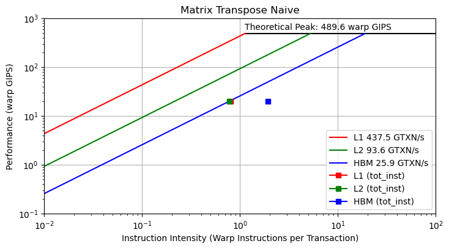

# Python Hierarchical Roofline Module

### Module to plot **hierarchical** roofline model for GPU single kernel based on nvprof metrics.

### Methodology can be found in the following paper:
### [Ding, Nan & Williams, Samuel. (2019). An Instruction Roofline Model for GPUs.](https://crd.lbl.gov/assets/Uploads/InstructionRooflineModel-PMBS19-.pdf)

## Metrics Used

- inst_executed_thread
: number of instructions executed by kernel

- gld/gst_transactions 
: total number of global transactions for L1

- shared_load/store_transactions 
:  total number of shared transactions for L1

- l2_read/write_transactions
: total number of L2 transactions

- dram_read/write_transactions
: total number of HBM transactions

From the above we get the following results:

- Instruction Intensity: (inst_executed_thread/32) / (# transactions) , instructions scaled to warp-level

- Performance: (inst_executed_thread/32) / (1e9 * run time) , kernel_time is provided in usecs

## Plotting Requirements

- [matplotlib](https://matplotlib.org/)

- [pandas](https://pandas.pydata.org/)

## Example with Tesla V100S

To simulate the module, a Matrix Transpose kernel from [cuda-samples](https://github.com/NVIDIA/cuda-samples), ***transposeNaive***, is run in GPU NVIDIA Tesla V100S

- Run script.sh by modifying appropriately
```
./script.sh
```
 - It produces timing/metrics_transpose.csv in ***example*** directory and the following roofline plot

  

---


## Bandwidth Ceilings
In module **plot.py** the ceilings for L1,L2 cache and HBM are sourced from the above-mentioned paper. Empirical bandwidths can be calculated by running  ***measure_bw.sh*** under GPU_Microbenchmarks folder (results for V100S are provided in bw_measurements.txt). The microbenchmarks used can be found here: [accel-sim/gpu-app-collection](https://github.com/accel-sim/gpu-app-collection/tree/release/src/cuda/GPU_Microbenchmark)

### **!** The module **plot.py** was designed based on the specific transpose kernel so user must modify it according to the required kernel ( Graph titles, metrics, kernel_name, etc. )