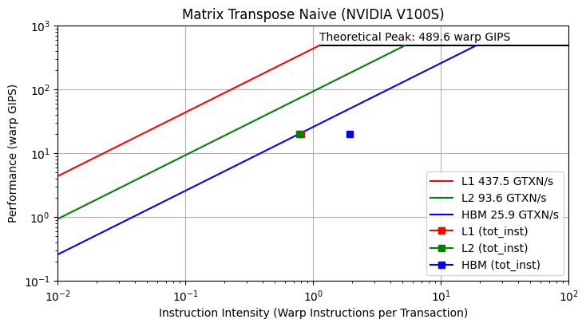
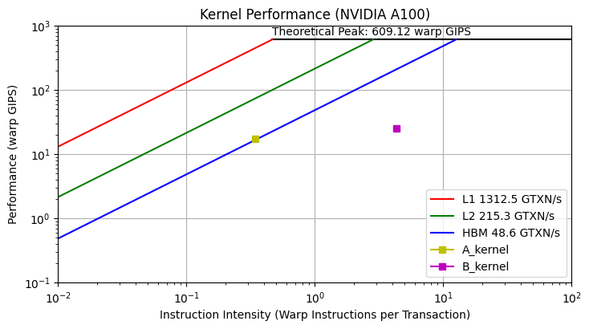

# Python Hierarchical Roofline Module

### Module to plot hierarchical roofline model for GPU kernels.

### Methodology can be found in the following paper:
### [Ding, Nan & Williams, Samuel. (2019). An Instruction Roofline Model for GPUs.](https://crd.lbl.gov/assets/Uploads/InstructionRooflineModel-PMBS19-.pdf)

## Metrics Used

- Νumber of instructions executed by kernel

- Τotal number of global transactions for L1

- Τotal number of shared transactions for L1

- Τotal number of L2 transactions

- Τotal number of HBM transactions

From the above we get the following results:

- Instruction Intensity: (No. Instructions/32) / (Νο. transactions) , instructions scaled to warp-level

- Performance: (No. Instructions/32) / (1e9 * run time) , kernel_time is provided in usecs

For **nvprof** and **ncu** metric comparison, the NSight Compute [User Manual](https://docs.nvidia.com/nsight-compute/2020.1/pdf/NsightComputeCli.pdf) can be used.

## Plotting Requirements

- [matplotlib](https://matplotlib.org/)

- [pandas](https://pandas.pydata.org/)

## How to use the roofline tool

### 1. Collect metrics with NVIDIA profiler

Use the **profile_nvp.sh** (for nvprof) or the **profile_ncu.sh** (for ncu) 

### 2. Modify roofline_tool.py 

  - Edit nvp, ncu dictionaries with appropriate metrics if needed

  - Edit **create_graph()** with peak GIPS and memory bandwidth values

  - Modify parameters in **main()** function:
    
    - Edit colors, markers & labels dictionaries with proper kernel names (l1, l2 & hbm keys are used for hierarchical roofline)

    - Define metric files 

    - Define the profiler used (nvp or ncu)

    - Define kernel name(s) as shown in csv files

    - Define memory types used for bw ceilings and for app characterization

    - Define graph elements

    - Choose roofline **mode**:

      - **0** : Hierarchical roofline for a single kernel 
      

      - **1** : Roofline Model for multiple kernels and chosen memory type(s)
      
  

---

## Bandwidth Ceilings
In module **roofline_tool.py** the ceilings for L1,L2 cache, HBM and maximum (warp-based) IPS  for the NVIDIA V100S and A100 GPU models, are sourced from the above-mentioned paper and from the [Ampere Whitepaper](https://images.nvidia.com/aem-dam/en-zz/Solutions/data-center/nvidia-ampere-architecture-whitepaper.pdf) respectively. Empirical bandwidths can be calculated by running  ***measure_bw.sh*** under GPU_Microbenchmarks folder (results for V100S are provided in bw_measurements.txt). The  ***measure_bw.sh*** currently supports only GPU models with **nvprof** profiling capabilities. The microbenchmarks used can be found here: [accel-sim/gpu-app-collection](https://github.com/accel-sim/gpu-app-collection/tree/release/src/cuda/GPU_Microbenchmark)