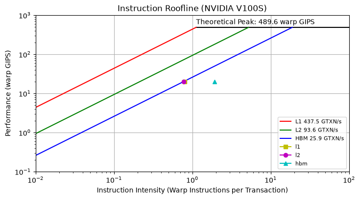
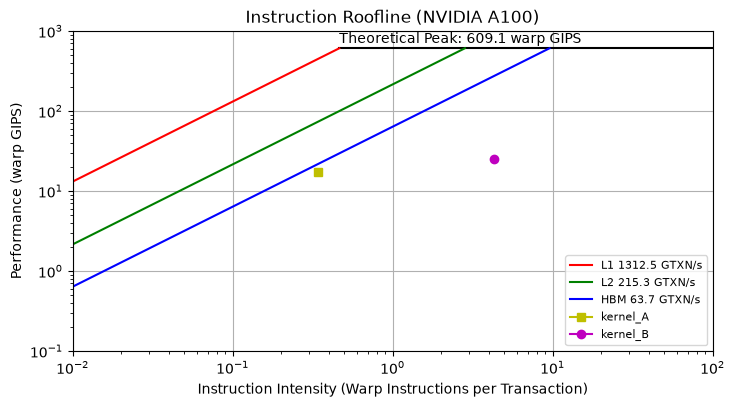
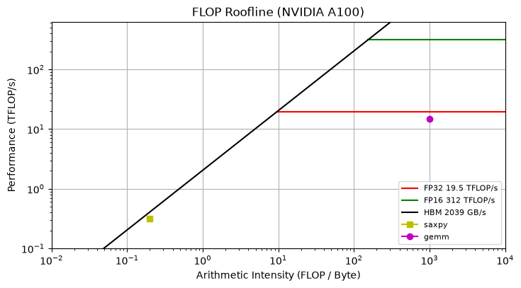

# GPU Hierarchical Roofline Tool

A command-line tool to plot **roofline models** for NVIDIA GPU kernels from
profiler output. It supports two complementary models:

1. **Instruction Roofline** — warp instructions/s vs. warp instructions per
   memory transaction, with hierarchical L1 / L2 / HBM ceilings
   ([Ding & Williams, LBL 2019](https://crd.lbl.gov/assets/Uploads/InstructionRooflineModel-PMBS19-.pdf)).
2. **Compute (FLOP) Roofline** — the classic FLOP/s vs. arithmetic intensity
   (FLOP/byte) model, with one compute ceiling per precision
   (FP32 / TF32 / FP16 / BF16 / FP8 / FP4) plus the HBM memory ceiling.

GPU peak/bandwidth ceilings live in a spec registry (`gpu_specs.py`) covering
Volta through Blackwell, selectable by name — no source editing required.

## Supported GPUs

| Key | Architecture | Notes |
|-----|--------------|-------|
| `V100S` | Volta | full instruction-roofline ceilings (LBL paper) |
| `A100` | Ampere | full instruction-roofline ceilings (whitepaper, 80GB) |
| `H100-SXM` | Hopper | adds FP8; L1/L2 GTXN/s need microbenchmarking |
| `H200-SXM` | Hopper | HBM3e, 4.8 TB/s |
| `B200` | Blackwell | adds native FP4 |
| `GB200` | Blackwell | per-GPU Grace-Blackwell figures |
| `RTX4090` | Ada | consumer, adds FP8 |
| `RTX5090` | Blackwell | consumer, adds FP4 (GDDR7) |

Tensor figures in `gpu_specs.py` are **dense** (non-sparse) TFLOP/s with **FP32
accumulate**; the datasheet headline numbers are ~2× these (2:4 structured
sparsity), and consumer Ada/Blackwell run FP16/FP8 with FP16 accumulate at 2× the
FP32-accumulate rate. H100/H200 are verified against the Hopper whitepaper and RTX
4090/5090 against the RTX Blackwell whitepaper (Appendix A); B200/GB200 non-tensor
FP32 has no primary whitepaper and is approximate. For Hopper and newer the L1/L2
instruction-roofline ceilings are not published — run the microbenchmarks (below)
to measure them; the HBM ceiling and compute ceilings are populated.

## Installation

```
pip install -r requirements.txt
```

Requires the NVIDIA profiler that produced your data on `PATH`
(**Nsight Compute / `ncu`** is recommended; `nvprof` is supported for legacy
Volta data but has been removed by NVIDIA for Ampere and newer).

## 1. Collect metrics with an NVIDIA profiler

Use `multi_kernels/profile_ncu.sh` (ncu) or `hierarchical/profile_nvp.sh`
(nvprof). Each produces three CSVs: `timing`, `events`, and `metrics`. The ncu
script also collects the FLOP counters (`fadd`/`fmul`/`ffma`) and
`dram__bytes.sum` needed for the compute roofline.

## 2. Plot

The tool is driven entirely from the command line:

```
python roofline_tool.py --gpu H100-SXM --mode flop \
    --timing timing.csv --metrics metrics.csv \
    --kernels my_kernel --precisions fp16 fp8 \
    --out roofline.png
```

Key options:

| Option | Meaning |
|--------|---------|
| `--gpu KEY` / `--autodetect` | pick a spec from the table, or detect via `nvidia-smi` |
| `--mode instruction\|flop` | which roofline model to draw |
| `--roofline-type hierarchical\|multi` | instruction mode: single kernel at L1/L2/HBM, or several kernels |
| `--profiler ncu\|nvprof` | which profiler produced the CSVs |
| `--timing / --events / --metrics` | the profiler CSVs (`--events` only for instruction mode) |
| `--kernels ...` | kernel name(s) exactly as they appear in the CSVs |
| `--memories l1 l2 hbm` | instruction mode: which memory level(s) to plot kernel points at |
| `--precisions fp32 fp16 fp8 fp4 ...` | flop mode: which compute ceilings to draw |
| `--out` / `--title` | output PNG and optional title |

## Examples

**Instruction roofline (hierarchical, single kernel — Volta):**

```
python roofline_tool.py --gpu V100S --mode instruction --roofline-type hierarchical \
    --profiler nvprof \
    --timing hierarchical/timing_transpose.csv \
    --events hierarchical/events_transpose.csv \
    --metrics hierarchical/metrics_transpose.csv \
    --kernels "transposeNaive(float*, float*, int, int)" --memories l1 l2 hbm \
    --out hierarchical/roofline_transpose.png
```


**Instruction roofline (multiple kernels — Ampere):**

```
python roofline_tool.py --gpu A100 --mode instruction --roofline-type multi \
    --timing multi_kernels/timing.csv --events multi_kernels/events.csv \
    --metrics multi_kernels/metrics.csv --kernels kernel_A kernel_B --memories l1 \
    --out multi_kernels/roofline_kernels.png
```


**Compute (FLOP) roofline (illustrative data under `flop_example/`):**

```
python roofline_tool.py --gpu A100 --mode flop \
    --timing flop_example/timing.csv --metrics flop_example/metrics.csv \
    --kernels saxpy gemm --precisions fp32 fp16 \
    --out flop_example/roofline_flop.png
```


`saxpy` is memory-bound (on the HBM ceiling); `gemm` is compute-bound (near the
FP32 ceiling).

## Metrics used

**Instruction roofline:** instructions executed (warp-scaled by /32); global +
shared L1 transactions; L2 transactions; HBM transactions. Intensity =
(instructions/32) / transactions; performance = (instructions/32) / (1e9 · runtime).

**Compute roofline:** single-precision FLOPs = `fadd + fmul + 2·ffma`; bytes =
`dram__bytes.sum`. Intensity = FLOP / byte; performance = FLOP / runtime.

## Measuring bandwidth ceilings

`GPU_Microbenchmarks/measure_bw.sh` builds and runs CUDA microbenchmarks
(adapted from [accel-sim/gpu-app-collection](https://github.com/accel-sim/gpu-app-collection/tree/release/src/cuda/GPU_Microbenchmark))
to measure empirical L1 / L2 / HBM bandwidth and peak IPS. Pass the SM count of
your GPU, e.g.:

```
SM=132 ./GPU_Microbenchmarks/measure_bw.sh
```

The Makefiles target `sm_70`–`sm_90` by default; uncomment the `sm_100`/`sm_120`
gencodes for Blackwell (requires CUDA 12.8+).

## Tests

```
python tests/test_specs.py
```
